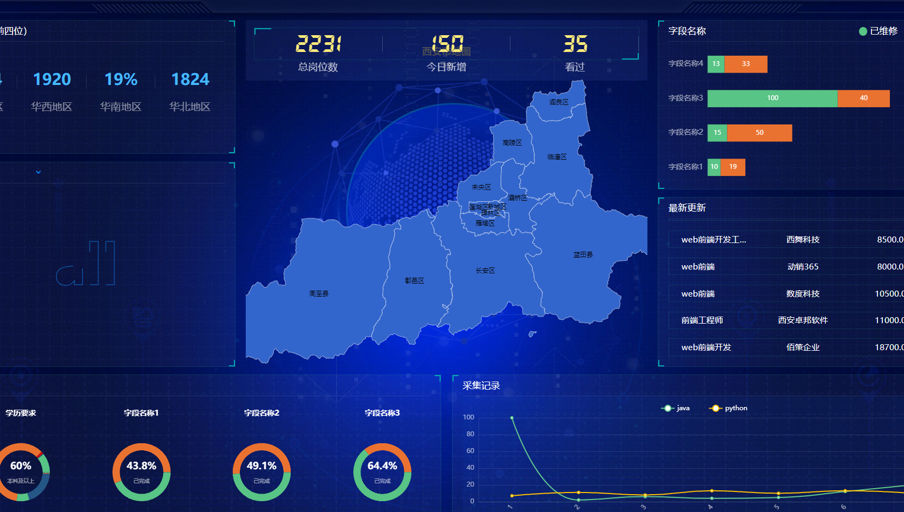
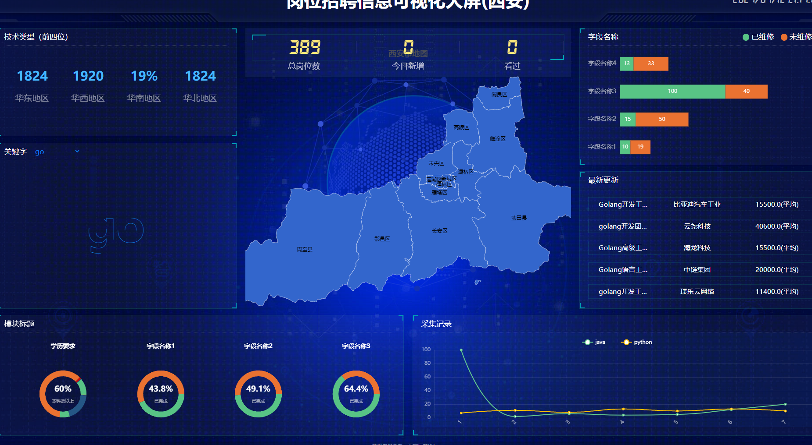
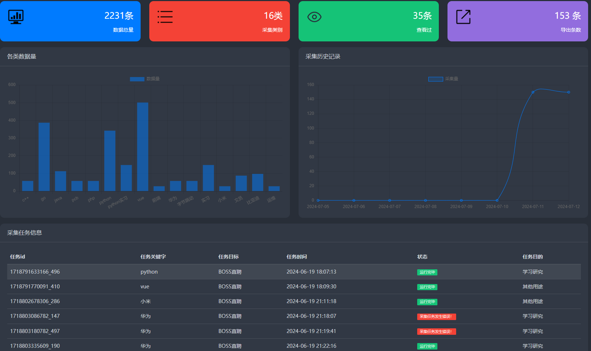
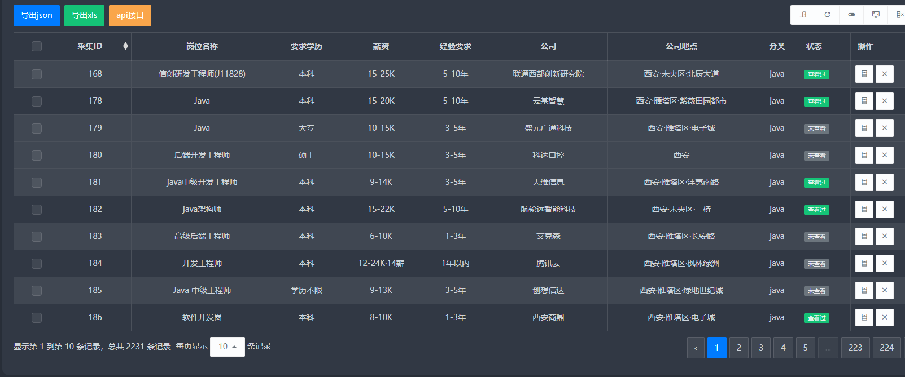

# [网络问题可看博客版](https://www.xaiohua.icu/?p=175)

# 一、项目介绍

> 本项目是一个结合Chrome扩展程序、Flask、数据可视化、爬虫以及Selenium自动化的综合项目。 为更好体现功能性，选择采集招聘网站信息为信息源。

# 二、项目目的

> 通过数据的采集清洗入库或持久化储存。实现数据可视化展示，以及采集数据的导出分享

# 三、实现方式

> ## 1、数据采集
>* 用户可以通过Web端后台，在表单输入关键字与筛选条件，既可实现自动化的信息采集，并进行数据可视化.
>* 还可通过Chrome扩展程序，实现自定义的数据采集。只需动动鼠标，即可实现数据的采集与持久化。
>> * Chrome扩展 https://github.com/16752774499/demo
>## 2、数据可视化
>* 使用了echarts，结合Flask Web框架，实现了数据的可视化页面展示。
>## 3、数据管理
>* 使用了Flask与开源后台模板实现了数据管理后台，支持数据多种导出方式（Excel、JSON、API接口）
>> * 后台模板 [@笔下光年]( https://gitee.com/yinqi/light-year-admin-using-v5-for-example)
>## 4、采集任务状态管理
>* 由于采集任务并不受Web模块的直接控制，故实现了一个状态管理模块，通过Web端后台，可以时时查看采集任务的执行情况。
>* 引入AnPush微信推送，采集任务成功与否（任务失败原因）都会及时推送到微信，方便用户随时掌握采集任务的执行情况。

# 四、效果演示

> ## 1.Chrome扩展程序，实现自定义的数据采集
>
>> [备用地址](https://www.xaiohua.icu/wp-content/uploads/2024/07/Chrome%E6%89%A9%E5%B1%95%E8%87%AA%E5%AE%9A%E4%B9%89%E9%87%87%E9%9B%86%E2%80%94%E2%80%94%E4%BD%BF%E7%94%A8Clipchamp%E5%88%B6%E4%BD%9C.mp4)
>## 2.Web端后台，发布采集任务
>
>> [备用地址](https://www.xaiohua.icu/wp-content/uploads/2024/07/Web%E5%90%8E%E5%8F%B0%E5%8F%91%E5%B8%83%E9%87%87%E9%9B%86%E4%BB%BB%E5%8A%A1%E2%80%94%E2%80%94%E4%BD%BF%E7%94%A8Clipchamp%E5%88%B6%E4%BD%9C.mp4)
>## 3.Web可视化页面（个别数据还未适配）
>
> 
>## 4.Web端后台，采集任务管理及采集信息
>
>## 5.Web端后台，采集信息导出(三种导出方式均已实现)
> 

# 五、运行方式

1. 安装依赖

```
   pip install -r requirements.txt
```

2. 修改配置文件config.py

```
   # 数据库配置
  dbcfg: dict = {
    "address": "192.168.0.6",
    "port": 3306,
    "dbname": "xiaohua",
    "user": "xiaohua",
    "passwd": "bwEP3xAahekCRHJQ"
}
   #redis配置
redisCfg: dict = {
    "host": "192.168.0.6",
    "port": 6379,
    "db": 0,
    "password": "redis_QBc2mF"
}
   # 微信推送配置
anPushCfg: dict = {
    "apiKey": "APIKEY",
    "channelId": "管道号",
    "to": "用户id",
    "url": "https://api.anpush.com/push/ZKKL659CGVWW6T8AS1LG8W7E07BO27"
}
```

2. 运行

```
   python app.py
```

3. 访问 [http://127.0.0.1:5000](http://127.0.0.1:5000/)

# 六、后续计划

> 1. 完善数据可视化页面
>2. 适配更多的站点采集
>3. 优化采集实现方式


